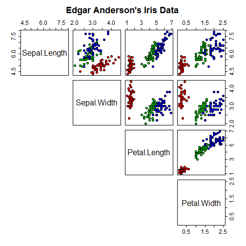

Edgar Anderson's Iris Data
========================================================
author: Jorge Antunes
date: 04-29-2016
transition: linear
transition-speed: slow

The iris data set is a favorite example for many Data Scientists

The exploration of the iris dataset enables all sort of analysis and techniques

Let's see what can we do with it


Exploratory Data Analysis
========================================================
class: explore
transition: linear
transition-speed: slow
For example, explore the "pairs", how important is to get a first insigth



Segmentation with K-Nearest Neighbor
========================================================
class: predictor
Using a KNN "predictor" you can see the Accuracy,

How easy it is and scalable it could be!!!


```
Cross-Validated (2 fold, repeated 2 times) Confusion Matrix 

(entries are un-normalized aggregated counts)
 
            Reference
Prediction   setosa versicolor virginica
  setosa        100          0         0
  versicolor      0         97         8
  virginica       0          3        92
                            
 Accuracy (average) : 0.9633
```
Check the Accuracy (Keep it in mind)


Predictor Random Forests and SVM
========================================================
class: predictor
Random Forests

```
$overall
      Accuracy          Kappa  AccuracyLower  AccuracyUpper   AccuracyNull 
  9.500000e-01   9.250000e-01   8.607568e-01   9.895677e-01   3.333333e-01 
AccuracyPValue  McnemarPValue 
  6.627821e-24            NaN 
```
Support Vector Machines with Radial Basis Function Kernel

```
$overall
      Accuracy          Kappa  AccuracyLower  AccuracyUpper   AccuracyNull 
  9.666667e-01   9.500000e-01   8.847190e-01   9.959374e-01   3.333333e-01 
AccuracyPValue  McnemarPValue 
  1.698703e-25            NaN 
```
Conclusions
========================================================
class: conclusion
- All the predictors have high accuracy results
- How important is the Algorithm
- How Important is the Pre-Process

For me everything is important, but above all, the adaptation...

Every model fit better to a subject than another, that's why is so important to be a Data Scientist, the ability to select the best model...

...and by Model I mean: Since the Pre-Process until the predictor parameters

